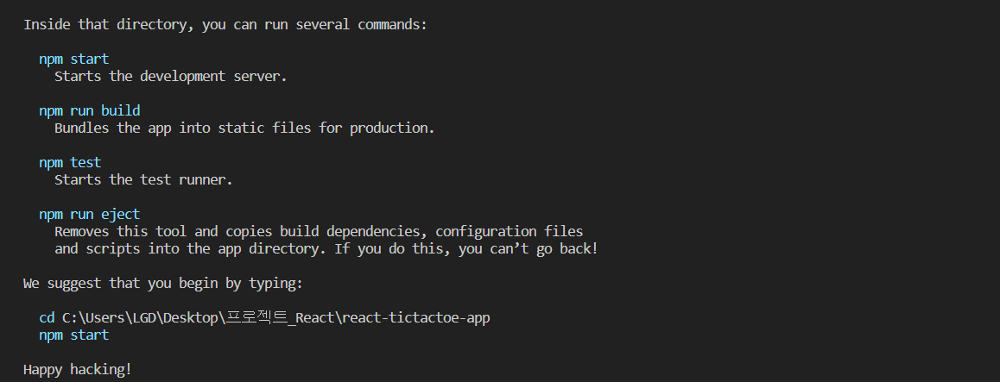

1. 여러 파일의 자바스크립트 코드를 압축하여 최적화 할 수 있기 때문에 로딩에 대한 네트워크 비용을 줄일 수 있다. 

2. 모듈 단위로 개발이 가능하여, 가독성과 유지보수가 쉽다. (= 파일을 여러개로 만들 수 있기 때문에 파일에 하나의 모듈을 만들고 다른 파일에 하나의 모듈을 만들 수 있고 이렇게, 파일을 여러개로 나눠 준 다음에 합쳐주면 된다.  그렇기 때문에 모듈 단위로 가능하다.


(1) 현재 디렉토리 안에 리액트를 설치하겠다

```
npx create-react-app ./
```



