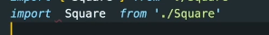
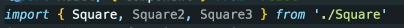
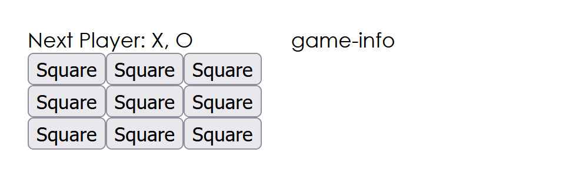
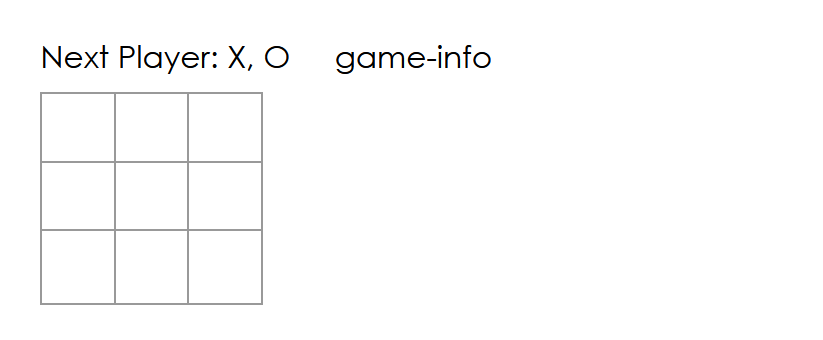

먼저 클래스 컴포넌트로 생성  그 후 함수 컴포넌트로 바꾸기


*// 많은 기능이 담긴 Component 을 class Square 에서 사용할 수 있도록 만들어주기* 

*// 리엑트에서 전해지는 Component을 extends 함으로 인해서* 

*// render 메소드도 사용할 수 있다.* 

*// render 안에 JSX를 작성 함으로서 화면에 보여진다.* 


설치 후 rcc 를 입력하면 코드를 직접 작성하지 않아도 자동으로 컴포넌트를 생성해준다. 

rcc 는 클래스 

rfc 는 함수형


---


보드 컴포넌트 


this 자체가 클래스를 가리킨다. 


*default* 와 export 의 차이 

*default*  는 클래스를 메인으로 밖으로 보내준다는 의미



export




---


app.js 

```
import "./App.css"
import Board from "./components/Board"


function App() {
  return (
    <div className="game">
      <div className="game-board">
       <Board />
      </div>
      <div className="game-info">
      game-info
      </div>
      
    </div>
  );
}

export default App;

```


square.js

```
import React from "react";

export class Square extends React.Component {
    render() {
        return (
            // 재사용성 O
            <button className="square"> Square </button>
        )
    }
}
```


board.js

```
// 많은 기능이 담긴 Component 을 class Square 에서 사용할 수 있도록 만들어주기 
// 리엑트에서 전해지는 Component을 extends 함으로 인해서 
// render 메소드도 사용할 수 있다. 
// render 안에 JSX를 작성 함으로서 화면에 보여진다. 

import React, { Component } from 'react'
import { Square } from './Square'

export default class Board extends Component {

    //클래스 안애 함수 지정 
    renderSquare(i) {
        return <Square />
    }


  render() {
    return (
      <div>
        <div className='status'>Next Player: X, O</div>
        <div className='board-row'>
            {this.renderSquare(0)}
            {this.renderSquare(1)}
            {this.renderSquare(2)}
        </div>
        <div className='board-row'>
            {this.renderSquare(3)}
            {this.renderSquare(4)}
            {this.renderSquare(5)}  
        </div>
        <div className='board-row'>
            {this.renderSquare(6)}  
            {this.renderSquare(7)}
            {this.renderSquare(8)}
        </div>
      </div>
    )
  }
}

```





---


스타일링

따로 css를 위한 파일 생성하기 





